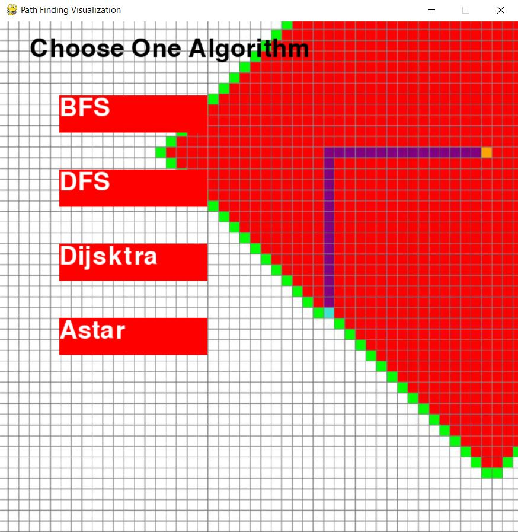

# Path Finding Visualization 
A Visualization of path finding algorithms like **BFS(Breadth First Search), DFS(Depth First Search), Dijsktra and Astar** which will help to find the path between two points.  

## About This Project 
This project is completely made is pygame library.  
what is pygame ? 
The pygame library is an open-source module for the Python programming language specifically intended to help you make games and other multimedia applications. Built on top of the highly portable SDL (Simple DirectMedia Layer) development library, pygame can run across many platforms and operating systems.

## How To Use 
In the Home screen, You can choose which algorithm you want to use find the path between tow points at a time you can use only one algorithm to use different algorithms use **esc** to go back **Home** menu and choose which ever you want to use.   
1. First choose a Algorithm .
2. Place a start point and end point on the grid. 
3. To place wall first have a start and end point Then you can make walls. 
4. Press According to your choosen algorithm. 
* To use BFS and DFS  
Press *Space* button    
* To use Dijsktra and Astar  
Press *Return* button   
5. To clear the screen press *C*.

**Home Menu**   
